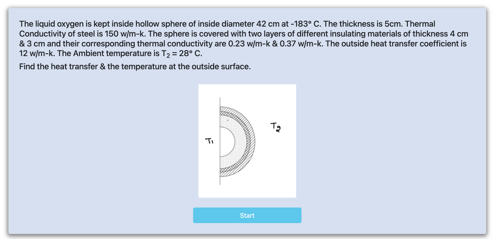

<h2>Follow the below steps to perform the experiment on the simulator</h2>
 

Step 1

Step 2

Step 3

Step 4

Step 5

Step 6

Step 7

Step 8 

Step 9 

Step 10 

Step 11 

Step 12 

Step 13 

Step 14 

Step 15 

Step 16 

